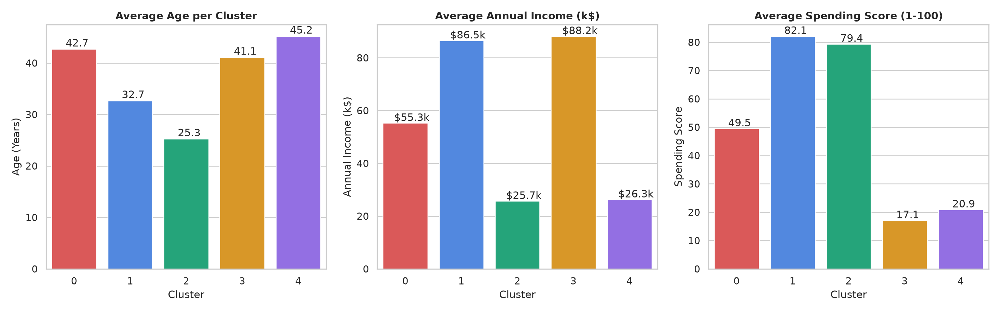
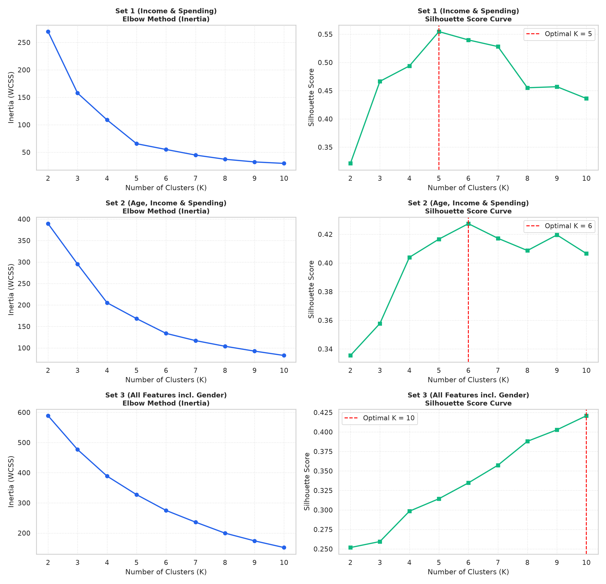
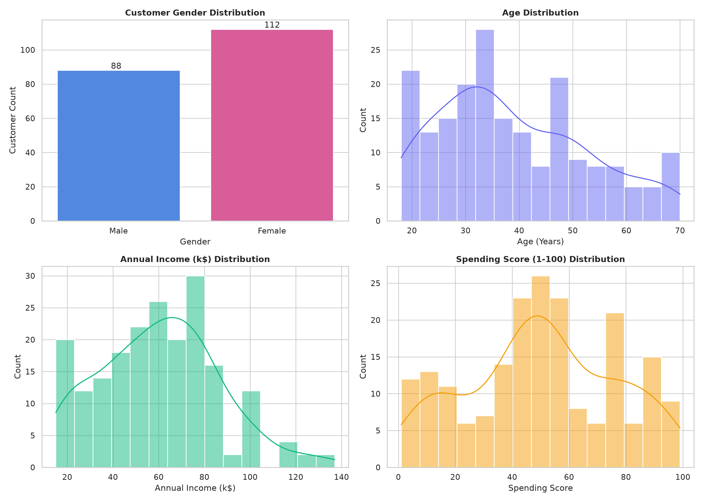
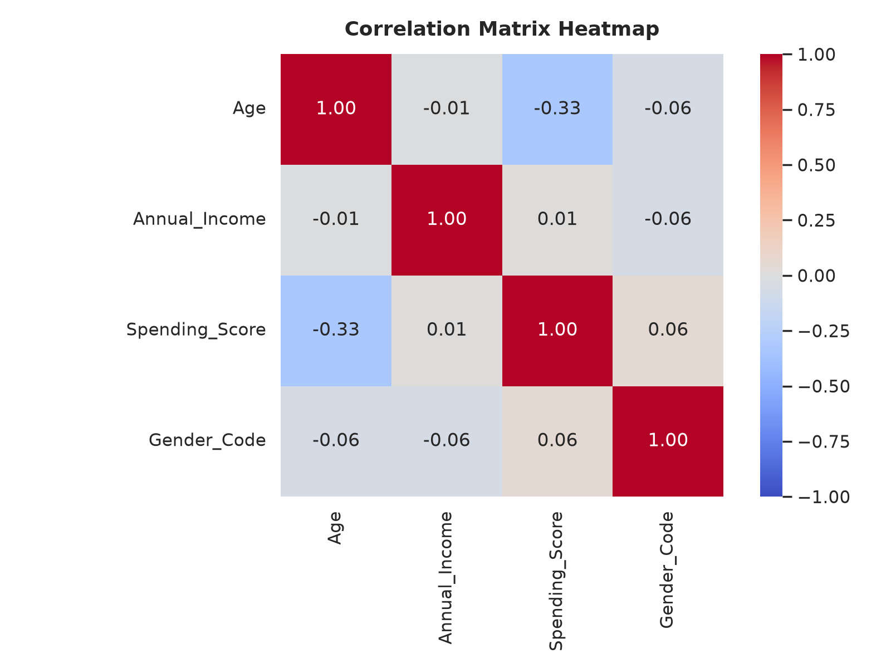

<div align="center">

# 🛍️ Customer Segmentation with K-Means Clustering

[](https://www.python.org/)
[](https://scikit-learn.org/)
[](https://pandas.pydata.org/)
[](https://cloudinary.com/)
[](https://scikit-learn.org/)
[](https://opensource.org/licenses/MIT)

<br/>

<p align="center">
  
</p>

<p align="center">
  <b>An unsupervised machine learning framework identifying actionable retail customer personas via multi-feature set optimization, Elbow evaluation, Silhouette validation, and PCA dimensionality reduction.</b>
</p>

---

</div>

## 🎯 Segmentation Performance & Cluster Personas

<div align="center">

| Cluster ID | Strategic Business Persona | Size (% Total) | Avg Age | Avg Income (k$) | Avg Spending Score | Gender Split |
| :---: | :--- | :---: | :---: | :---: | :---: | :---: |
| **0** | 🎯 **Moderate Middle-Class** *(Balanced Core)* | 81 (40.5%) | 42.7 yrs | $55.3k | 49.5 / 100 | 59.3% Female |
| **1** | 💎 **Target VIPs / Whales** *(High Income & High Spend)* | 39 (19.5%) | 32.7 yrs | $86.5k | 82.1 / 100 | 53.8% Female |
| **2** | 🚀 **Impulsive Trendsetters** *(Low Income & High Spend)* | 22 (11.0%) | 25.3 yrs | $25.7k | 79.4 / 100 | 59.1% Female |
| **3** | 🛡️ **Frugal Affluents / Savers** *(High Income & Low Spend)* | 35 (17.5%) | 41.1 yrs | $88.2k | 17.1 / 100 | 45.7% Female |
| **4** | 🏷️ **Budget Economical** *(Low Income & Low Spend)* | 23 (11.5%) | 45.2 yrs | $26.3k | 20.9 / 100 | 60.9% Female |

</div>

<br/>

### 📊 2D Cluster Space (Income vs Spending) & PCA Projection

<p align="center">
  
  
</p>

### 📈 Cluster Profile Comparison Bar Charts
<p align="center">
  
</p>

---

## 🔬 Multi-Feature Set Optimization Benchmark

To determine the ideal segmentation boundary, 3 feature spaces were preprocessed and evaluated across $K \in [2, 10]$ using the **Elbow Method (Inertia)** and **Silhouette Coefficient**:

<div align="center">

| Feature Set Configuration | Features Evaluated | Optimal $K$ | Peak Silhouette Score | Inertia (WCSS) | Verdict |
| :--- | :--- | :---: | :---: | :---: | :---: |
| 🏆 **Set 1 (Income & Spending)** | `Annual Income`, `Spending Score` | **`K = 5`** | **`0.5547`** | **`65.57`** | **Winner (Best Separability)** |
| **Set 2 (Age, Income & Spending)** | `Age`, `Annual Income`, `Spending Score` | `K = 6` | `0.4274` | `133.87` | Good sub-segmentation |
| **Set 3 (All Features incl. Gender)** | `Gender`, `Age`, `Annual Income`, `Spending Score` | `K = 10` | `0.4208` | `152.03` | Granular demographic split |

</div>

<p align="center">
  
</p>

---

## 📌 Executive Summary

This project implements an unsupervised customer segmentation engine on the Mall Customers dataset. By standardizing continuous variables and experimenting with feature dimensionality, the pipeline classifies retail shoppers into distinct behavioral segments to guide personalized marketing, customer retention, and inventory strategies.

The pipeline runs 100% online, streaming raw datasets directly from high-speed Cloudinary CDNs with zero local file path dependencies.

---

## 📊 Exploratory Data Analysis (EDA)

<p align="center">
  
  
</p>

---

## 🚀 Quickstart & Reproduction

### 1. Clone the repository
```bash
git clone https://github.com/Hix-001/PRODIGY_ML_02.git
cd PRODIGY_ML_02
```

### 2. Install dependencies
```bash
pip install -r requirements.txt
```

### 3. Run the complete pipeline
```bash
python customer_segmentation.py
```

The script streams the dataset directly from Cloudinary, generates all comparative visual plots in `outputs/`, prints full cluster diagnostics, and exports the labeled dataset to `outputs/segmented_mall_customers.csv`.

---

## 🔮 Future Scope & Scalability Roadmap

- **🌐 Density-Based & Hierarchical Clustering**: Benchmark **DBSCAN** and **HDBSCAN** to detect non-spherical clusters and customer outliers.
- **🕒 RFM Behavioral Dynamics**: Incorporate Recency, Frequency, and Monetary (RFM) transactional features over time.
- **⚡ Automated Re-Clustering Microservice**: Deploy via **FastAPI** to dynamically assign incoming shoppers to cluster personas in real time.

---

<div align="center">
  <b>Developed for the Prodigy InfoTech Machine Learning Internship Program</b><br/>
  ⭐ <i>Star this repository if you found it helpful!</i>
</div>
