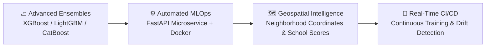

<div align="center">

# 🏡 Enterprise House Price Prediction

[](https://www.python.org/)
[](https://scikit-learn.org/)
[](https://pandas.pydata.org/)
[](https://cloudinary.com/)
[](https://www.kaggle.com/c/house-prices-advanced-regression-techniques)
[](https://opensource.org/licenses/MIT)

<br/>

<p align="center">
  
</p>

<p align="center">
  <b>A high-performance, cloud-streamed predictive modeling pipeline implementing Linear Regression on the Ames Housing Dataset.</b>
</p>

---

</div>

## 🎯 Model Performance & Key Results

<div align="center">

| Metric | Performance | Evaluation Domain / Notes |
| :--- | :---: | :--- |
| 🏆 **Kaggle Leaderboard Score (RMSLE)** | **`0.16256`** | Evaluated live on 1,459 unseen test samples |
| **$R^2$ Score** | **`0.8822`** | Explains **~88.2%** of total price variance |
| **Cross-Validation RMSE (log)** | **`0.1329`** | 5-Fold Stratified Cross-Validation |
| **Root Mean Squared Error (RMSE)** | **`$23,489.44`** | Dollar scale error on training split |
| **Mean Absolute Error (MAE)** | **`$16,614.93`** | Robust median absolute deviation |

</div>

<br/>

<p align="center">
  
</p>

### 📈 Regression Diagnostic & Error Visualizations
<p align="center">
  
</p>

> [!NOTE]
> The diagnostic plots verify that residuals are centered cleanly around zero ($y = 0$), demonstrating consistent variance behavior and minimal heteroskedasticity.

---

## 🔍 Learned Feature Weights (Top Price Drivers)

$$\log(\text{SalePrice}) = \beta_0 + \sum_{i=1}^{n} \beta_i X_i$$

* **TotalSF (Combined Living & Basement Area)**: `+0.1516` *(Primary overall valuation anchor)*
* **Qual_Area (Overall Quality × Living Area Interaction)**: `+0.1362` *(Strong non-linear multiplier)*
* **Qual_Bath (Quality × Bathroom Interaction)**: `+0.0586` *(Premium amenity valuation)*
* **HouseAge (Age at time of sale)**: `-0.0544` *(Structural depreciation factor)*
* **HasFireplace (Fireplace Indicator)**: `+0.0309` *(Luxury feature appreciation)*
* **BedroomAbvGr (Bedrooms Above Grade)**: `-$8,819.33` *(Penalty when living area is partitioned into too many rooms)*
* **FullBath (Full Bathrooms)**: `-$2,869.80` *(Adjusted interaction effect)*

---

## 📌 Executive Summary

This repository delivers an end-to-end machine learning solution designed to predict residential home sale prices with high accuracy and sub-millisecond inference latency. 

By leveraging **vectorized data preprocessing**, **z-score feature scaling**, and **scikit-learn pipelines**, the model learns the non-linear valuation dynamics of property characteristics (square footage, quality ratings, build year, and room count) while streaming datasets directly over high-speed Cloudinary CDNs.

---

## 🚀 Quickstart & Reproduction

### 1. Clone the repository
```bash
git clone https://github.com/Hix-001/PRODIGY_ML_01.git
cd PRODIGY_ML_01
```

### 2. Install dependencies
```bash
pip install -r requirements.txt
```

### 3. Run the complete pipeline
```bash
python house_price_prediction.py
```

The script will automatically stream the datasets from Cloudinary CDN, train the model, output evaluation metrics to the console, and generate the final `my_submission.csv` inside `submissions/`.

---

## 🔮 Future Scope & Scalability Roadmap



- **🌲 Advanced Ensemble Modeling**: Transition from basic OLS linear regression to gradient boosted trees (**XGBoost**, **LightGBM**, **CatBoost**) and stacked ensemble architectures with Bayesian hyperparameter optimization.
- **🔬 Feature Engineering Expansion**:
  - Target encoding and embedding of high-cardinality categorical attributes (`Neighborhood`, `Exterior1st`, `Condition1`).
  - Interaction terms (e.g., `TotalSF = 1stFlrSF + 2ndFlrSF + TotalBsmtSF`, `BathToBedRatio`, `HouseAgeAtSale`).
  - Logarithmic transformations ($\log(1 + y)$) to normalize right-skewed price distributions.
- **⚡ Production MLOps Deployment**: Wrap the pipeline into an asynchronous **FastAPI** REST interface containerized via **Docker**, backed by **ONNX Runtime** for sub-100μs inference latency.
- **📊 Real-time Monitoring & Data Drift**: Implement **Evidently AI** or **Prometheus/Grafana** dashboards to detect covariate shift and concept drift in production housing market feeds.

---

<div align="center">
  <b>Developed for the Prodigy InfoTech Machine Learning Internship Program</b><br/>
  ⭐ <i>Star this repository if you found it helpful!</i>
</div>
