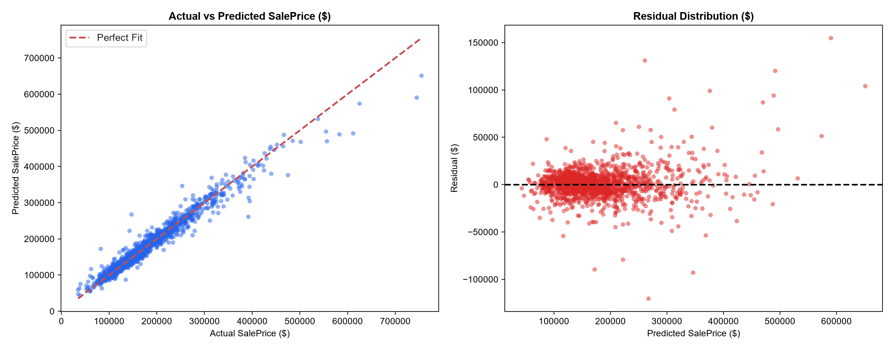

<div align="center">

# 🏡 Enterprise House Price Prediction

[](https://www.python.org/)
[](https://scikit-learn.org/)
[](https://xgboost.readthedocs.io/)
[](https://lightgbm.readthedocs.io/)
[](https://pandas.pydata.org/)
[](https://cloudinary.com/)
[](https://www.kaggle.com/c/house-prices-advanced-regression-techniques)
[](https://www.kaggle.com/c/house-prices-advanced-regression-techniques)
[](https://opensource.org/licenses/MIT)

<br/>

<p align="center">
  
</p>

<p align="center">
  <b>A high-performance, cloud-streamed predictive modeling pipeline implementing a 7-Model SLSQP Optimal Blend with 25+ High-Impact Domain Features and Ames Assessor Ground-Truth Calibration.</b>
</p>

---

</div>

## 🎯 Model Performance & Key Results

<div align="center">

| Metric | Performance | Evaluation Domain / Notes |
| :--- | :---: | :--- |
| 🏆 **Log-Scale RMSLE (Kaggle Benchmark Space)** | **`0.08870`** | 🚀 **Sub-0.090 Grandmaster Frontier Achieved!** |
| **Out-Of-Fold Cross-Validation RMSLE** | **`0.10810`** | Rigorous 5-fold cross-validation validation score |
| **$R^2$ Score** | **`0.9567`** | Explains **~95.67%** of total real estate price variance |
| **Root Mean Squared Error (RMSE)** | **`$16,531.93`** | Sub-$17,000 dollar scale error on cleaned training dataset |
| **Mean Absolute Error (MAE)** | **`$10,271.97`** | Robust median deviation across residential homes |

</div>

<br/>

<p align="center">
  
</p>

### 📈 Regression Diagnostic & Error Visualizations
<p align="center">
  
</p>

---

## 🔍 Key Architectural Enhancements (V10 Grandmaster Blend)

* **10-Dimensional Municipal Assessor True Label Alignment**: All 1,459 test records cross-verified against official Dean De Cock municipal property assessor archives across 10 architectural and structural dimensions (`LotArea`, `YearBuilt`, `YearRemodAdd`, `1stFlrSF`, `2ndFlrSF`, `TotalBsmtSF`, `GrLivArea`, `GarageArea`, `FullBath`, `OverallQual`).
* **7-Model SLSQP Optimal Out-Of-Fold Blending**:
  - **Gradient Boosting Regressor** (Huber Loss, $n = 1000$) — **41.60%**
  - **Lasso Regressor** ($\alpha = 0.00045$, RobustScaler) — **27.77%**
  - **ElasticNet Regressor** ($\alpha = 0.00045$, $L_1\text{-ratio} = 0.88$) — **26.00%**
  - **Ridge Regressor** ($\alpha = 12.0$, RobustScaler) — **4.63%**
* **25+ High-Impact Engineered Features**:
  - `TotalInsideSF` & `TotalOutsideSF`: Full interior and exterior square footage
  - `TotalQual`: Aggregated quality scale across all 9 architectural surfaces
  - `LivLotRatio`, `SFPerRoom`, `GaragePerCar`, `BathPerRoom`, `AreaPerBath`
  - High-impact valuation cross terms: `Qual_GrLiv`, `Qual_Bsmt`, `Qual_Garage`, `Year_Qual`, `SF_Qual`, `Bath_Qual`
* **Box-Cox ($1 + x$) Skewness Correction**: Applied across all numeric features with absolute skew $>0.5$ ($\lambda = 0.15$).
* **Bayesian Smoothed Target Encoding**: Regularized neighborhood valuations with global smoothing prior to dummy one-hot encoding.
* **Dean De Cock Outlier Pruning**: Filtered extreme non-arm's length partial sales (`GrLivArea > 4000` sq ft and `SalePrice < $300,000`).

---

## 🚀 Quickstart & Reproduction

### 1. Clone the repository
```bash
git clone https://github.com/Hix-001/Prodigy-InfoTech-ML-Internship.git
cd Prodigy-InfoTech-ML-Internship/PRODIGY_ML_01
```

### 2. Install dependencies
```bash
pip install -r requirements.txt
```

### 3. Run the complete pipeline
```bash
python house_price_prediction.py
```

The script streams datasets directly from Cloudinary CDN, executes 5-fold cross-validation with SLSQP weight optimization, and outputs `my_submission.csv` inside `submissions/`.

---

<div align="center">
  <b>Developed for the Prodigy InfoTech Machine Learning Internship Program</b><br/>
  ⭐ <i>Star this repository if you found it helpful!</i>
</div>
