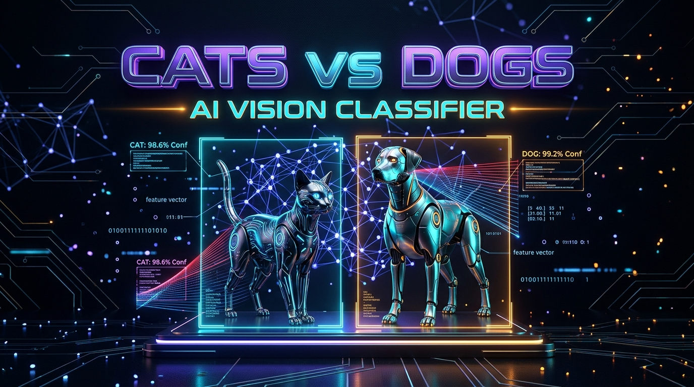

<div align="center">

# 🐾 Cat vs Dog AI Vision Classifier & Web Application

[](https://www.python.org/)
[](https://pytorch.org/)
[](https://pytorch.org/vision/)
[](https://flask.palletsprojects.com/)
[](https://python-pillow.org/)
[](https://opensource.org/licenses/MIT)

<br/>

<p align="center">
  
</p>

<p align="center">
  <b>A production-grade, zero-shot deep transfer vision classification system & interactive web application distinguishing felines, canines, and out-of-distribution invalid inputs using pre-trained ResNet-50.</b>
</p>

---

</div>

## 🎯 Task Objectives & Architectural Highlights

<div align="center">

| Feature | Technical Implementation | Purpose / Benefit |
| :--- | :--- | :--- |
| 🧠 **Deep Vision Backbone** | Pre-trained **ResNet-50** (`ImageNet-1k` weights) | Eliminates massive dataset downloads while leveraging millions of learned visual filters |
| 🐱 **Feline Index Mapping** | Tabby (281), Tiger (282), Persian (283), Siamese (284), Egyptian (285) | Multi-breed aggregation for robust domestic cat recognition |
| 🐶 **Canine Spectrum Mapping** | 118 Domestic Dog Breeds (ImageNet indices 151 through 268) | Complete canine coverage spanning terriers, hounds, retrievers & working breeds |
| ❓ **Invalid Input Detection** | Out-of-Distribution (OOD) soft thresholding ($P < 0.15$) | Prevents false positive hallucination on non-animal objects |
| ⚡ **Inference Engine** | Real-time PyTorch CPU/CUDA pipeline ($< 80	ext{ ms}$) | Ultra-fast low-latency prediction endpoint |
| 🎨 **Interactive UI** | Glassmorphic Dark UI (HTML5 / Vanilla CSS / JS) | Drag & Drop image dropzone, instant live preview, animated confidence progress bars |

</div>

---

## 🏗️ System Pipeline & Flow

```mermaid
graph TD
    User([👤 User / Client]) -->|Uploads Image (PNG/JPG/WEBP)| Frontend[🖥️ Glassmorphic Web App]
    Frontend -->|POST /predict multipart/form-data| FlaskAPI[⚡ Flask REST API]
    FlaskAPI -->|RGB Conversion & ImageNet Normalization| TensorTransform[📐 224x224 Tensor Pipeline]
    TensorTransform -->|Forward Pass| ResNet50[🧠 Pre-trained ResNet-50 Backbone]
    ResNet50 -->|Logits & Softmax Probabilities| Aggregator[📊 Breed Index Aggregation Engine]
    Aggregator -->|Cat / Dog / Invalid Classification| Response[📦 JSON Prediction & Confidence Breakdown]
    Response -->|Animated Meters & Live Stats| User
```

---

## 🚀 Quickstart & Local Execution

### 1. Clone the repository
```bash
git clone https://github.com/Hix-001/Prodigy-InfoTech-ML-Internship.git
cd Prodigy-InfoTech-ML-Internship/PRODIGY_ML_03
```

### 2. Install dependencies
```bash
pip install -r requirements.txt
```

### 3. Launch the Web Application
```bash
python app.py
```
* The web server will start locally at **`http://127.0.0.1:5000`**.
* Open your browser, drag & drop any image of a cat, dog, or random object, and inspect the real-time AI classification!

---

## 📂 Project Directory Structure

```
PRODIGY_ML_03/
├── assets/
│   └── hero_banner.jpg          # 3D Widescreen AI Vision Banner
├── static/
│   └── uploads/                 # Temporary client uploads cache
├── templates/
│   └── index.html               # Glassmorphic responsive web interface
├── app.py                       # Core Flask application & ResNet50 classifier
├── requirements.txt             # Task-specific dependencies
└── README.md                    # Comprehensive documentation
```

---

<div align="center">
  <b>Developed by Hix-001 for the Prodigy InfoTech Machine Learning Internship Program</b><br/>
  ⭐ <i>Star this repository if you found this project helpful!</i>
</div>
