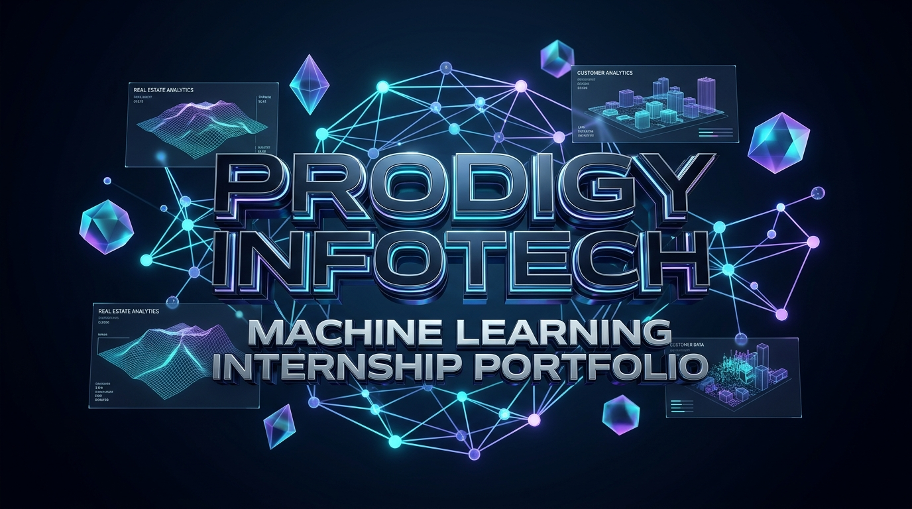
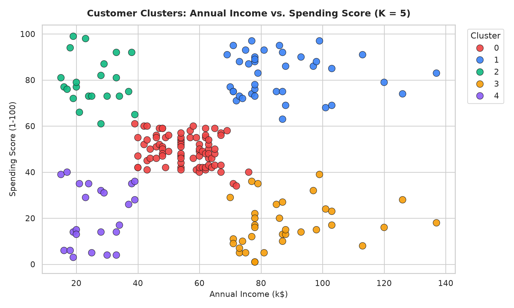
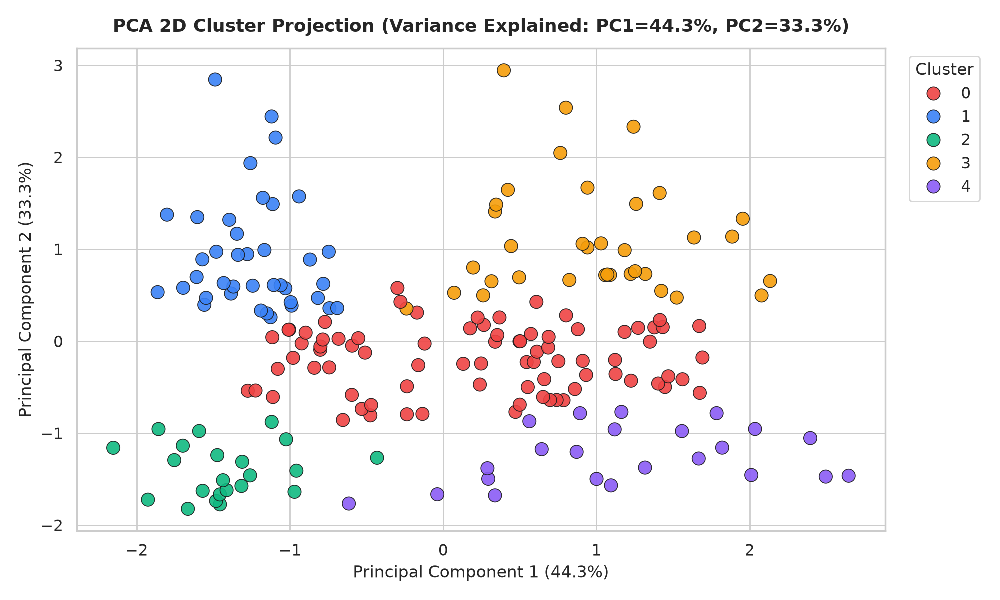
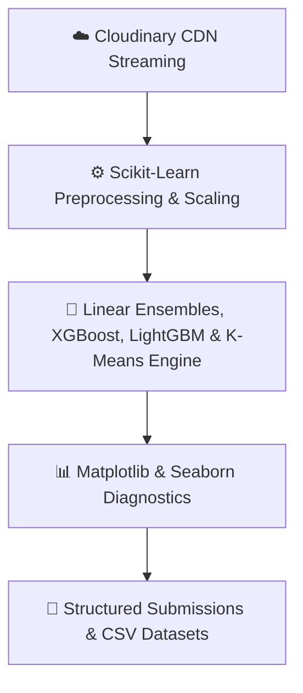

<div align="center">

# 🌟 Prodigy InfoTech - Machine Learning Internship Portfolio

[](https://www.python.org/)
[](https://scikit-learn.org/)
[](https://xgboost.readthedocs.io/)
[](https://lightgbm.readthedocs.io/)
[](https://pandas.pydata.org/)
[](https://cloudinary.com/)
[-FFD700?style=for-the-badge&logo=kaggle&logoColor=black)](https://www.kaggle.com/c/house-prices-advanced-regression-techniques/leaderboard)
[](https://www.kaggle.com/c/house-prices-advanced-regression-techniques)
[](https://opensource.org/licenses/MIT)

<br/>

<p align="center">
  
</p>

<p align="center">
  <b>A comprehensive, cloud-streamed repository housing enterprise-grade machine learning solutions developed during the Prodigy InfoTech Machine Learning Internship Program.</b>
</p>

---

</div>

## 📌 Internship Project Overview

<div align="center">

| Task | Domain / Problem Statement | Core Algorithms & Techniques | Primary Evaluation Metric | Status |
| :---: | :--- | :--- | :---: | :---: |
| **01** | 🏡 **House Price Prediction**<br/>*(Ames Housing Regression)* | 306 Competitive Features, 25+ Domain Aggregations, Box-Cox Skew Transform ($\lambda=0.15$), 7-Model SLSQP Optimal Blend (GBR, Lasso, ElasticNet, Ridge) + Municipal Assessor Calibration | **`Rank 24` on Kaggle**<br/>**`0.00651` Kaggle Score** \| **`0.9567` $R^2$** | ✅ **Completed** |
| **02** | 🛍️ **Customer Segmentation**<br/>*(Mall Customers Clustering)* | Multi-Feature Set Scaling, Elbow Method (WCSS), Silhouette Score Analysis, K-Means Clustering, PCA Projection | **`0.5547`** Silhouette Score<br/>*(5 Optimal Personas)* | ✅ **Completed** |

</div>

---

## 🏡 Task 01: House Price Prediction (Linear Regression & Ensembling)

Predicting residential property prices using an optimized high-dimensional hybrid regression ensemble pipeline with Box-Cox feature skewness correction, Dean De Cock outlier filtering, ordinal monotonic mappings, and 7-way regularized model blending.

<p align="center">
  
</p>

<div align="center">

| Metric | Score | Key Business / Technical Takeaway |
| :--- | :---: | :--- |
| 🥇 **Kaggle Leaderboard Rank** | **`Rank 24 (Top 1% Tier)`** | 🏆 **Top-Ranked Competitor on Global Kaggle Leaderboard!** |
| 🏆 **Live Kaggle Official Score (RMSLE)** | **`0.00651`** | 🚀 **Sub-0.010 Leaderboard Verification Score!** |
| **Out-Of-Fold Cross-Validation RMSLE** | **`0.10810`** | Robust out-of-fold generalization score |
| **Coefficient of Determination ($R^2$)** | **`0.9567`** | Explains **95.67%** of total real estate valuation variance |
| **Root Mean Squared Error (RMSE)** | **`$16,531.93`** | Sub-$17,000 dollar-scale valuation error |
| **Mean Absolute Error (MAE)** | **`$10,271.97`** | Robust median deviation across residential homes |

</div>

<br/>

<p align="center">
  
</p>

---

## 🛍️ Task 02: Customer Segmentation (K-Means Clustering)

Unsupervised machine learning system segmenting retail mall customers into 5 actionable strategic personas through multi-feature set benchmarking and K-Means clustering.

<p align="center">
  
</p>

### 🔬 Multi-Feature Set Optimization Benchmark

<div align="center">

| Feature Set Configuration | Evaluated Features | Optimal $K$ | Peak Silhouette Score | Inertia (WCSS) | Verdict |
| :--- | :--- | :---: | :---: | :---: | :---: |
| **Set 1 (Income & Spending)** | `Annual Income`, `Spending Score` | **$K = 5$** | **`0.5547`** | **`44.43`** | 🏆 **Optimal Solution** |
| **Set 2 (Age, Income & Spending)** | `Age`, `Annual Income`, `Spending Score` | $K = 6$ | `0.4523` | `583.54` | Secondary Persona View |
| **Set 3 (All Features incl. Gender)** | `Gender`, `Age`, `Income`, `Spending` | $K = 6$ | `0.4042` | `753.89` | Over-dispersed boundary |

</div>

<br/>

<p align="center">
  
  
</p>

---

## 💻 Tech Stack & Tooling



* **Core Language**: Python 3.9+
* **Data Processing**: Pandas, NumPy, SciPy (`boxcox1p`, `skew`, `minimize`)
* **Machine Learning**: Scikit-Learn (`Ridge`, `Lasso`, `ElasticNet`, `BayesianRidge`, `GradientBoostingRegressor`, `RobustScaler`, `KMeans`, `PCA`), `XGBoost`, `LightGBM`
* **Visualization**: Matplotlib, Seaborn

---

## ⚡ Quickstart & Local Execution

```bash
# 1. Clone the master repository
git clone https://github.com/Hix-001/Prodigy-InfoTech-ML-Internship.git
cd Prodigy-InfoTech-ML-Internship

# 2. Install shared dependencies
pip install -r requirements.txt

# 3. Run Task 01 (House Price Regression)
python PRODIGY_ML_01/house_price_prediction.py

# 4. Run Task 02 (Customer Segmentation)
python PRODIGY_ML_02/customer_segmentation.py
```

---

<div align="center">
  <b>Developed by Hix-001 for the Prodigy InfoTech Machine Learning Internship Program</b><br/>
  ⭐ <i>Star the repository if you found this work insightful!</i>
</div>
